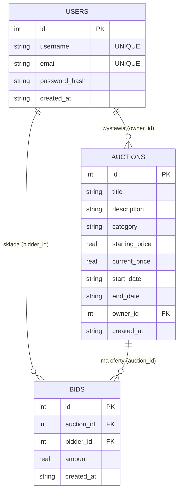

# Serwis Aukcyjny — REST API + React

Praca zaliczeniowa z przedmiotu **Tworzenie usług sieciowych REST**.

Rozproszony system aukcji internetowych: użytkownicy rejestrują się, wystawiają przedmioty,
przeglądają aukcje i licytują. Frontend komunikuje się z systemem **wyłącznie przez REST API** —
nigdy bezpośrednio z bazą danych.

Cały projekt znajduje się w tym katalogu:

```
react/
├── backend/    REST API (Node.js + Express + SQLite)
└── frontend/   interfejs (React + Vite)
```

## Spis treści
- [Architektura](#architektura)
- [Stos technologiczny](#stos-technologiczny)
- [Model danych (ERD)](#model-danych-erd)
- [Uruchomienie](#uruchomienie)
- [Opis endpointów](#opis-endpointów)
- [Reguły biznesowe](#reguły-biznesowe)
- [Testy](#testy)
- [Realizacja wymagań](#realizacja-wymagań)

## Architektura

Backend zbudowany jest w **architekturze warstwowej** z wyraźnym rozdzieleniem
odpowiedzialności (Controller → Service → Repository → Model):

```
HTTP (klient: React / Swagger)
        │
        ▼
┌──────────────────────────────────────────────┐
│  Routes        — definicja tras + middleware   │
│  Middleware    — JWT, walidacja, obsługa błędów│
│  Controllers   — odbiór żądania, kody HTTP     │  warstwa prezentacji
├──────────────────────────────────────────────┤
│  Services      — LOGIKA BIZNESOWA              │  warstwa domeny
├──────────────────────────────────────────────┤
│  Repositories  — zapytania SQL                 │  warstwa danych
│  Database      — SQLite (node:sqlite)          │
└──────────────────────────────────────────────┘
        ▲
        │  DTO — mapowanie rekord ↔ reprezentacja API (camelCase, bez haseł)
```

- **Controller** nie wie nic o SQL; **Repository** nie zna reguł biznesowych;
  **Service** spina logikę. Każda warstwa zależy tylko od warstwy poniżej.
- **DTO** gwarantują, że `password_hash` nigdy nie opuszcza serwera, a API zwraca `camelCase`.
- Błędy biznesowe sygnalizowane są wyjątkiem `AppError(statusCode, message)`, który
  globalny `errorHandler` mapuje na jednolitą odpowiedź JSON.

```
backend/
├── src/
│   ├── config/        env, logger (winston), database (SQLite), openapi (Swagger)
│   ├── routes/        authRoutes, userRoutes, auctionRoutes
│   ├── controllers/   authController, userController, auctionController
│   ├── services/      authService, userService, auctionService, bidService
│   ├── repositories/  userRepository, auctionRepository, bidRepository
│   ├── dto/           mapowanie na reprezentację API
│   ├── middleware/    authenticate (JWT), validate, errorHandler
│   ├── validators/    reguły express-validator
│   ├── utils/         AppError, asyncHandler
│   ├── app.js         konfiguracja Express
│   ├── server.js      punkt wejścia
│   └── seed.js        dane przykładowe
└── tests/             testy integracyjne (Jest + supertest)

frontend/
└── src/pages/         Aukcje, Szczegóły+licytacja, Wystaw, Logowanie
```

## Stos technologiczny

| Warstwa     | Technologia                                             |
|-------------|---------------------------------------------------------|
| Backend     | Node.js 22+, Express                                     |
| Baza danych | SQLite przez wbudowany `node:sqlite` (zero natywnych zależności) |
| Autoryzacja | JWT (`jsonwebtoken`) + hashowanie haseł (`bcryptjs`)    |
| Walidacja   | `express-validator`                                     |
| Dokumentacja| OpenAPI 3.0 + Swagger UI                                |
| Logowanie   | `winston` + `morgan`                                     |
| Testy       | Jest + supertest                                        |
| Frontend    | React 18, React Router, Vite                            |
| Konteneryzacja | Docker + docker-compose                              |

## Model danych (ERD)



Relacje z `ON DELETE CASCADE`: usunięcie użytkownika usuwa jego aukcje i oferty;
usunięcie aukcji usuwa jej oferty. `status` aukcji (`scheduled`/`active`/`ended`)
jest **wyliczany** z dat względem czasu bieżącego, nie przechowywany.

## Uruchomienie

### Wariant A — lokalnie (Node 22+)

**Backend:**
```bash
cd backend
cp .env.example .env          # (Windows: copy .env.example .env)
npm install
npm run seed                  # opcjonalnie: dane przykładowe + konta testowe
npm start                     # http://localhost:3000  (Swagger: /api-docs)
```

**Frontend** (w drugim terminalu):
```bash
cd frontend
npm install
npm run dev                   # http://localhost:5173
```

Vite proxuje `/api/*` na backend `:3000`, więc frontend nie wymaga konfiguracji CORS w dev.

### Wariant B — Docker (sam backend)

```bash
cd backend
docker compose up --build     # API na http://localhost:3000
```

Konta testowe po `npm run seed`: `alice@example.com` / `bob@example.com` / `carol@example.com`
(hasło: `haslo123`).

## Opis endpointów

Pełna, interaktywna dokumentacja: **`http://localhost:3000/api-docs`** (Swagger UI),
specyfikacja maszynowa: `http://localhost:3000/openapi.json`.

### Auth
| Metoda | Ścieżka          | Opis                          | Auth |
|--------|------------------|-------------------------------|------|
| POST   | `/auth/register` | Rejestracja, zwraca JWT       | —    |
| POST   | `/auth/login`    | Logowanie, zwraca JWT         | —    |

### Użytkownicy
| Metoda | Ścieżka       | Opis                              | Auth |
|--------|---------------|-----------------------------------|------|
| POST   | `/users`      | Dodanie użytkownika (alias rejestracji) | — |
| GET    | `/users`      | Lista użytkowników (paginacja)    | —    |
| GET    | `/users/:id`  | Pobranie użytkownika              | —    |
| PUT    | `/users/:id`  | Edycja (tylko właściciel konta)   | JWT  |
| DELETE | `/users/:id`  | Usunięcie (tylko właściciel konta)| JWT  |

### Aukcje
| Metoda | Ścieżka          | Opis                                            | Auth |
|--------|------------------|-------------------------------------------------|------|
| GET    | `/auctions`      | Lista (filtrowanie, sortowanie, paginacja)      | —    |
| GET    | `/auctions/:id`  | Pobranie aukcji                                 | —    |
| POST   | `/auctions`      | Wystawienie przedmiotu                           | JWT  |
| PUT    | `/auctions/:id`  | Edycja (tylko właściciel aukcji)                | JWT  |
| DELETE | `/auctions/:id`  | Usunięcie (tylko właściciel aukcji)             | JWT  |

Parametry `GET /auctions`: `page`, `limit`, `category`, `status` (`active`/`ended`/`scheduled`),
`sortBy` (`created_at`/`end_date`/`current_price`/`title`), `order` (`asc`/`desc`).

### Licytacja
| Metoda | Ścieżka               | Opis                          | Auth |
|--------|-----------------------|-------------------------------|------|
| POST   | `/auctions/:id/bids`  | Złożenie oferty               | JWT  |
| GET    | `/auctions/:id/bids`  | Historia ofert aukcji         | —    |

Kody HTTP: `200`, `201`, `204`, `400` (walidacja/reguła biznesowa), `401` (brak/niepoprawny token),
`403` (brak uprawnień), `404` (brak zasobu), `409` (konflikt unikalności), `500`.

### Przykład (cURL)
```bash
# 1. logowanie -> token
TOKEN=$(curl -s -X POST localhost:3000/auth/login \
  -H "Content-Type: application/json" \
  -d '{"email":"bob@example.com","password":"haslo123"}' | jq -r .token)

# 2. licytacja
curl -X POST localhost:3000/auctions/1/bids \
  -H "Authorization: Bearer $TOKEN" -H "Content-Type: application/json" \
  -d '{"amount":650}'
```

## Reguły biznesowe

- Oferta musi być **wyższa** niż aktualna cena aukcji (inaczej `400`).
- Nie można licytować **przed startem** ani **po zakończeniu** aukcji (`400`).
- Właściciel **nie może licytować** własnej aukcji (`403`).
- Edytować/usuwać aukcję lub konto może **tylko właściciel** (`403`).
- Złożona oferta podnosi `current_price` i trafia do **historii ofert**.
- Hasła przechowywane są jako hash bcrypt; API nigdy nie zwraca hasła.

## Testy

```bash
cd backend
npm test
```

15 testów integracyjnych (Jest + supertest) na bazie w pamięci (`:memory:`) — pokrywają
CRUD, walidację, autoryzację oraz wszystkie reguły licytacji.

## Realizacja wymagań

| Wymaganie | Realizacja |
|-----------|------------|
| REST API, poprawne metody HTTP i kody | Express, kody 2xx/4xx/5xx |
| Architektura warstwowa | Controller → Service → Repository → Model |
| Trwałe przechowywanie | SQLite (`node:sqlite`) |
| Walidacja danych | `express-validator` + middleware `validate` |
| Obsługa wyjątków | `AppError` + globalny `errorHandler` |
| DTO | `src/dto/index.js` |
| Dokumentacja API | Swagger UI / OpenAPI 3.0 |
| Interfejs użytkownika | React (komunikacja tylko przez REST) |
| **(+)** Autoryzacja JWT | `jsonwebtoken` + middleware `authenticate` |
| **(+)** Paginacja / filtrowanie / sortowanie | `GET /auctions` |
| **(+)** Konteneryzacja | Dockerfile + docker-compose |
| **(+)** Testy jednostkowe | Jest + supertest |
| **(+)** Logowanie operacji | winston + morgan |
